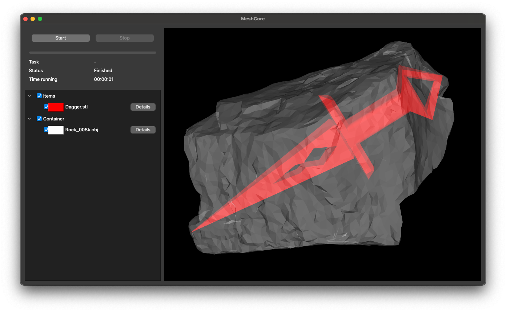

# Local search heuristics for single volume maximisation problems

## General information

`svmp-heuristic` provides the local search heuristics for 3D single volume maximisation problems that were described in 
["Efficient use of collision detection for volume maximization problems"](https://doi.org/10.1016/j.ejor.2024.05.048). 
Please cite this publication when referencing this project.

This project depends on the [MeshCore library](https://github.com/JonasTollenaere/MeshCore) for loading files, rendering and providing the necessary geometric operations.
The project use uses CMake as its build system.
We recommend using vcpkg as a package manager to install the dependencies that are defined in the `vcpkg.json` file.
To set up a development environment, we refer to the [vcpkg documentation](https://vcpkg.io/en/getting-started).

## CMake targets

- **SingleExample**: Solves a single problems instance and renders the solution
- **Benchmark**: Runs a benchmark over all instances from the paper
- **NormalisationExample**: Shows the effect of normalisation when an item is scaled
- **SensitivityAnalysis**: Performs the first set of sensitivity analysis experiments
- **SensitivityAnalysis2**: Performs the second set of sensitivity analysis experiments